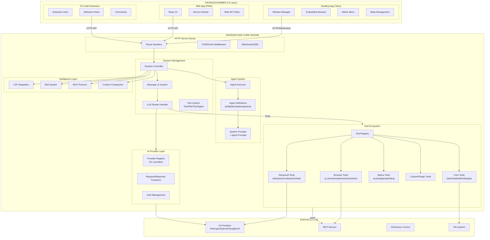
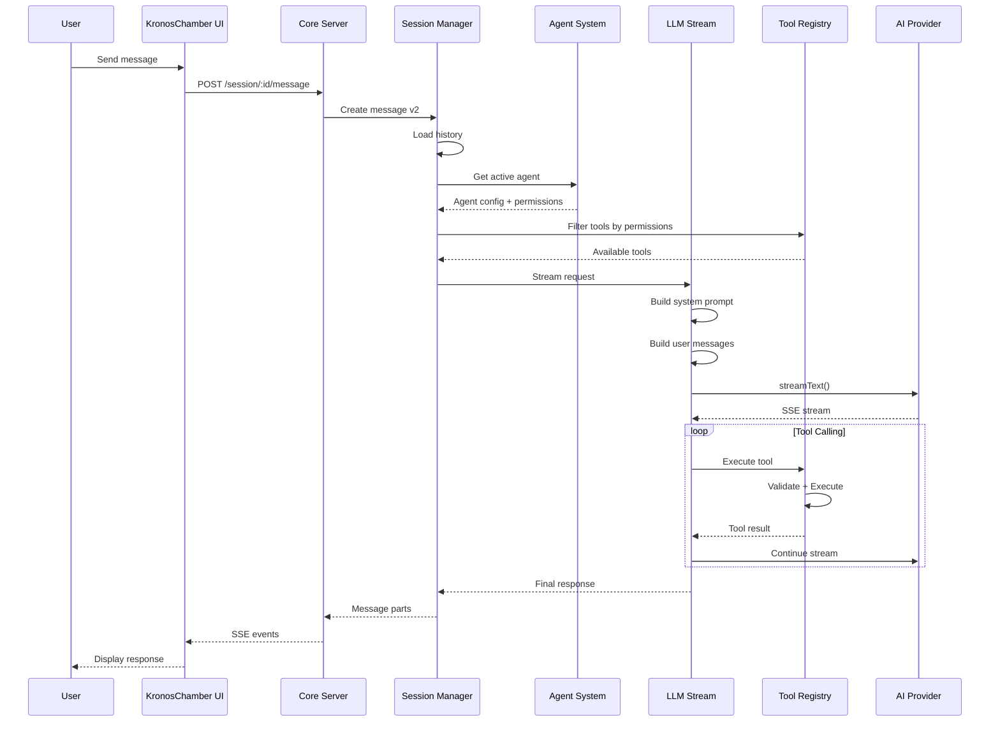
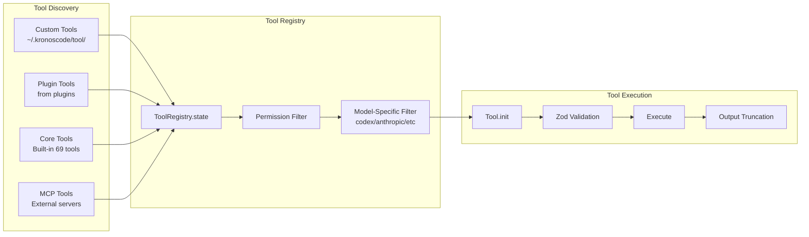
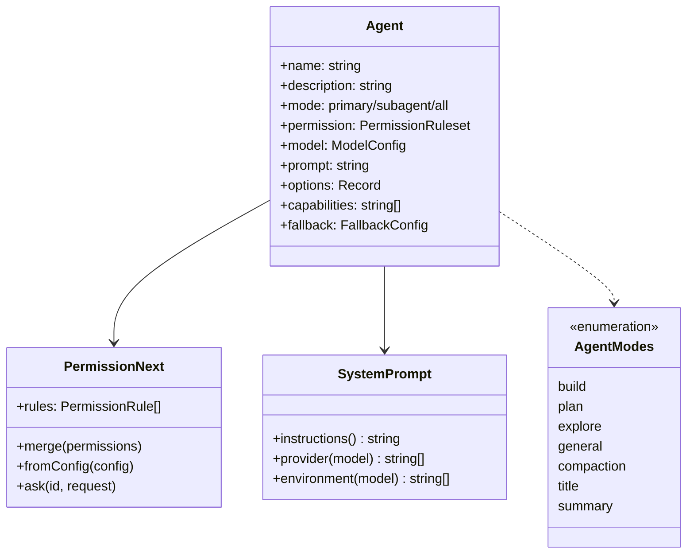

# KronosCode Architecture Analysis & Improvement Recommendations

## Current Architecture Overview

### 1. SYSTEM ARCHITECTURE DIAGRAM



### 2. REQUEST FLOW DIAGRAM



### 3. TOOL REGISTRATION & ROUTING



### 4. AGENT ARCHITECTURE



---

## What Can Be Improved

### 🔴 CRITICAL ISSUES

1. **Prompt Architecture Fragmentation**
   - **Current**: Prompts scattered across `agent/prompt/`, `session/prompt/`, system.ts, hardcoded strings
   - **Problem**: No unified prompt management system, difficult to version control, test, or iterate
   - **Impact**: Inconsistent AI behavior, difficult to debug, hard to optimize

2. **Tool Routing Logic is Complex and Fragile**
   - **Current**: Tool filtering happens in `ToolRegistry.tools()` with complex conditionals for different models
   - **Problem**: Hard-coded model checks (e.g., `model.modelID.includes("gpt-")`), difficult to extend
   - **Impact**: Adding new providers requires modifying core logic, high risk of breaking existing tools

3. **Agent-Tool Permission Coupling**
   - **Current**: Permissions defined in agent config, tools filtered at runtime
   - **Problem**: No clear separation between "what agent can do" vs "what user allows"
   - **Impact**: Confusing permission model, difficult to audit

4. **Session State Management Complexity**
   - **Current**: MessageV2 system with parts, snapshots, patches - complex data model
   - **Problem**: Multiple state sources (DB, memory, SSE streams), difficult to sync
   - **Impact**: Race conditions, lost messages, difficult to debug

### 🟡 MODERATE ISSUES

5. **No Clear Routing Layer**
   - **Current**: Request goes directly from server → session → LLM
   - **Problem**: No middleware layer for logging, rate limiting, caching, request transformation
   - **Impact**: Difficult to add cross-cutting concerns

6. **Tool Discovery is Static**
   - **Current**: Tools discovered at startup, cached in `Instance.state()`
   - **Problem**: No hot-reloading, dynamic tool registration limited
   - **Impact**: Long restart times, difficult to add tools dynamically

7. **Limited Observability**
   - **Current**: Basic logging with `Log.create()`, no structured tracing
   - **Problem**: Difficult to trace a request through the system, debug tool failures
   - **Impact**: Longer debugging cycles, poor reliability

8. **No Request Deduplication/Caching**
   - **Current**: Every request hits the LLM, no caching layer
   - **Problem**: Expensive redundant calls, slow for repeated queries
   - **Impact**: Higher costs, slower response times

### 🟢 IMPROVEMENT OPPORTUNITIES

9. **Prompt Versioning & A/B Testing**
   - **Opportunity**: Add prompt versioning system, ability to test prompt variations
   - **Benefit**: Data-driven prompt optimization, rollback capability

10. **Intelligent Tool Pre-loading**
    - **Opportunity**: Predict and pre-initialize tools based on context
    - **Benefit**: Faster tool execution, better UX

11. **Request Batching**
    - **Opportunity**: Batch similar tool calls together
    - **Benefit**: Reduced API calls, better performance

12. **Streaming Improvements**
    - **Opportunity**: Better SSE management, connection pooling, reconnection logic
    - **Benefit**: More reliable real-time updates

---

## Specific Recommendations

### 1. Implement a Unified Prompt Management System

```typescript
// New: packages/kronoscode/src/prompt/

export namespace PromptManager {
  // Versioned prompts with metadata
  export interface PromptVersion {
    id: string
    version: string
    content: string
    variables: string[]
    model: string[] // which models this works with
    performance: {
      successRate: number
      avgTokens: number
      userRating: number
    }
  }

  // Prompt registry with A/B testing support
  export async function getPrompt(id: string, context: PromptContext): Promise<string>

  // Template engine with variable substitution
  export function render(prompt: string, variables: Record<string, any>): string
}
```

### 2. Create a Proper Routing Middleware Layer

```typescript
// New: packages/kronoscode/src/router/

export namespace Router {
  export interface Middleware {
    (ctx: RoutingContext, next: () => Promise<void>): Promise<void>
  }

  export interface RoutingContext {
    request: UserRequest
    session: Session
    agent: Agent.Info
    tools: Tool.Info[]
    metadata: {
      startTime: number
      requestId: string
      traceId: string
    }
  }

  // Middleware stack
  export const middleware: Middleware[] = [
    LoggingMiddleware,
    RateLimitMiddleware,
    CacheMiddleware,
    PermissionMiddleware,
    ToolRoutingMiddleware, // NEW: intelligent tool selection
    PromptInjectionMiddleware, // NEW: prompt optimization
  ]
}
```

### 3. Implement Intelligent Tool Routing

```typescript
// Enhanced: packages/kronoscode/src/tool/router.ts

export namespace ToolRouter {
  // Instead of hard-coded model checks, use capability-based routing
  export interface ToolRoutingStrategy {
    // Match tools based on model capabilities
    match(tools: Tool.Info[], model: Provider.Model, intent: UserIntent): Tool.Info[]

    // Dynamic tool ordering based on context
    prioritize(tools: Tool.Info[], context: SessionContext): Tool.Info[]

    // Tool chaining suggestions
    suggestChain(executedTool: Tool.Info, context: SessionContext): Tool.Info[]
  }

  // Intent-based routing (10x feature from analysis)
  export function routeByIntent(
    userMessage: string,
    availableTools: Tool.Info[],
    sessionContext: SessionContext,
  ): ToolRoute
}
```

### 4. Add Observability with OpenTelemetry

```typescript
// New: packages/kronoscode/src/telemetry/

export namespace Telemetry {
  // Trace a request through the entire system
  export interface RequestTrace {
    traceId: string
    spanId: string
    parentSpanId?: string
    operation: string
    startTime: number
    endTime?: number
    metadata: {
      sessionId: string
      agent: string
      model: string
      toolsUsed: string[]
    }
  }

  // Tool execution telemetry
  export interface ToolExecution {
    toolId: string
    duration: number
    success: boolean
    inputTokens: number
    outputTokens: number
    cacheHit: boolean
  }
}
```

### 5. Implement Request Caching & Deduplication

```typescript
// New: packages/kronoscode/src/cache/

export namespace RequestCache {
  // Semantic caching for similar requests
  export async function getSimilar(request: UserRequest): Promise<CachedResponse | null>

  // Tool result caching
  export async function getToolResult(toolId: string, args: unknown): Promise<unknown | null>

  // Cache invalidation strategies
  export function invalidate(sessionId: string, pattern: string): void
}
```

### 6. Dynamic Tool Hot-Reloading

```typescript
// Enhanced: packages/kronoscode/src/tool/hotreload.ts

export namespace ToolHotReload {
  // Watch for file changes
  export function watch(directory: string): void

  // Hot-reload a tool without restart
  export async function reloadTool(toolId: string): Promise<void>

  // Tool sandboxing for safety
  export interface ToolSandbox {
    tool: Tool.Info
    permissions: string[]
    maxExecutionTime: number
    allowedFilePaths: string[]
  }
}
```

### 7. Simplify Session State Management

```typescript
// Refactor: packages/kronoscode/src/session/state.ts

export namespace SessionState {
  // Single source of truth
  export interface State {
    session: Session
    messages: MessageV2.WithParts[]
    pendingToolCalls: Map<string, ToolCall>
    context: SessionContext
  }

  // Event sourcing for replay/debugging
  export interface StateEvent {
    type: "message" | "tool_call" | "tool_result" | "compaction"
    timestamp: number
    data: unknown
  }

  // Simplified sync to DB
  export async function persist(state: State): Promise<void>
  export async function hydrate(sessionId: string): Promise<State>
}
```

### 8. Add Context-Aware Tool Chaining

```typescript
// 10x Feature: Context-Aware Tool Chaining
// packages/kronoscode/src/tool/chaining.ts

export namespace ToolChaining {
  // Automatically chain tools based on semantic understanding
  export interface ChainSuggestion {
    tools: string[] // e.g., ["glob", "read", "edit"]
    confidence: number
    estimatedTokens: number
    reason: string
  }

  // Learn from successful chains
  export async function learnFromSuccess(userIntent: string, toolChain: string[], result: boolean): Promise<void>

  // Predict next tool based on current context
  export async function predictNextTool(
    sessionContext: SessionContext,
    lastToolResult: ToolResult,
  ): Promise<ToolPrediction>
}
```

---

## Implementation Priority

### Phase 1: Foundation (Do Now)

1. **Unified Prompt Management** - Critical for consistency
2. **Telemetry/Observability** - Essential for debugging current issues
3. **Request Caching** - Immediate performance improvement

### Phase 2: Routing Improvements (Do Next)

4. **Middleware Router Layer** - Enables other improvements
5. **Intelligent Tool Routing** - 10x feature potential
6. **Tool Hot-Reloading** - Developer experience improvement

### Phase 3: Advanced Features (Explore)

7. **Context-Aware Tool Chaining** - Transformative feature
8. **Simplified State Management** - Architecture improvement
9. **Dynamic Tool Discovery** - Platform extensibility

---

## File Locations Reference

### Core Architecture Files:

- `packages/kronoscode/src/index.ts` - Main entry
- `packages/kronoscode/src/server/server.ts` - HTTP server
- `packages/kronoscode/src/session/message-v2.ts` - Message system
- `packages/kronoscode/src/session/llm.ts` - LLM streaming
- `packages/kronoscode/src/session/system.ts` - System prompts
- `packages/kronoscode/src/agent/agent.ts` - Agent definitions
- `packages/kronoscode/src/tool/registry.ts` - Tool registration
- `packages/kronoscode/src/tool/tool.ts` - Tool interface
- `packages/kronoscode/src/provider/provider.ts` - Provider management

### KronosChamber Integration:

- `kronosChamber/packages/web/server/` - Web server routes
- `kronosChamber/packages/desktop/src-tauri/src/main.rs` - Desktop native code
- `kronosChamber/packages/ui/src/` - Shared UI components

---

## Summary

The KronosCode architecture is **sophisticated but fragmented**. The main improvements needed are:

1. **Centralize prompt management** - Currently scattered, needs unified system
2. **Add proper routing layer** - Currently direct coupling, needs middleware
3. **Improve observability** - Hard to debug, needs tracing
4. **Add intelligent routing** - Static tool selection, needs context-aware routing
5. **Simplify state management** - Complex data model, needs simplification

These improvements would transform the system from a **functional but complex** architecture to a **maintainable, observable, and extensible** platform that can support the 10x features identified in the analysis.
