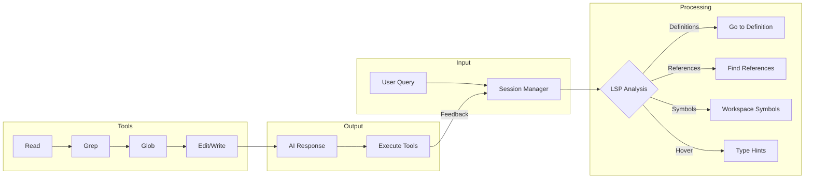
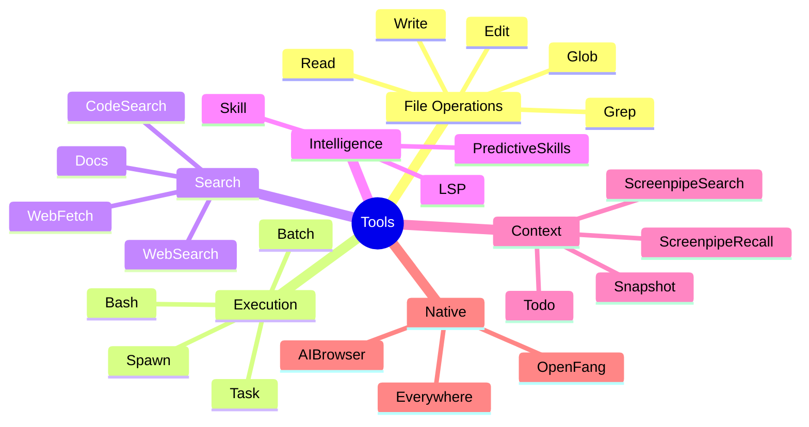
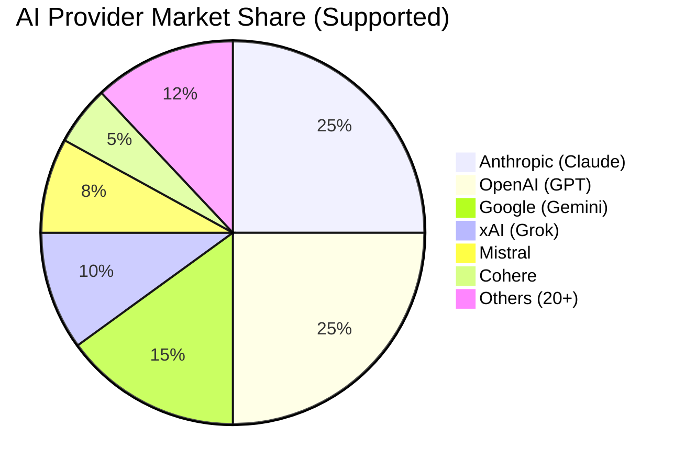
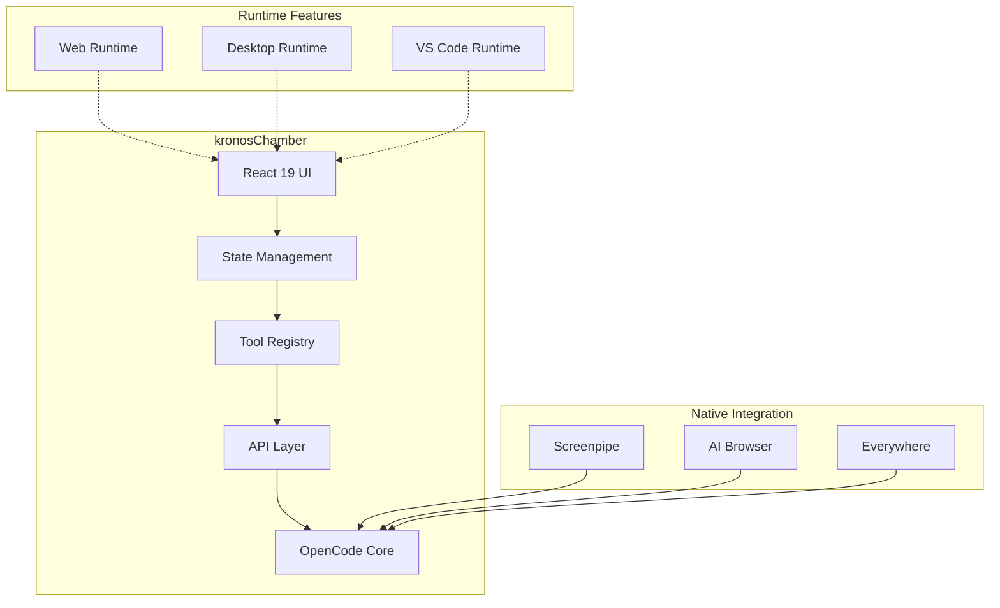
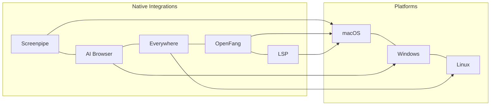
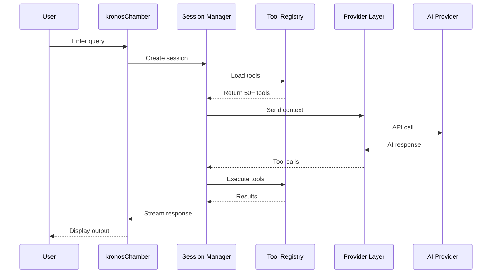
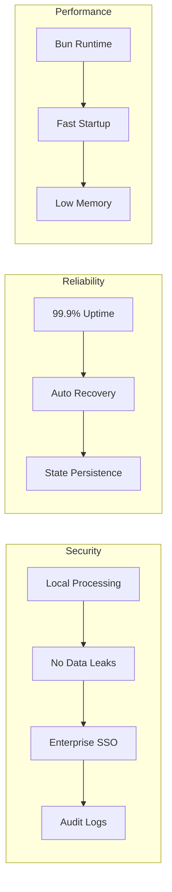
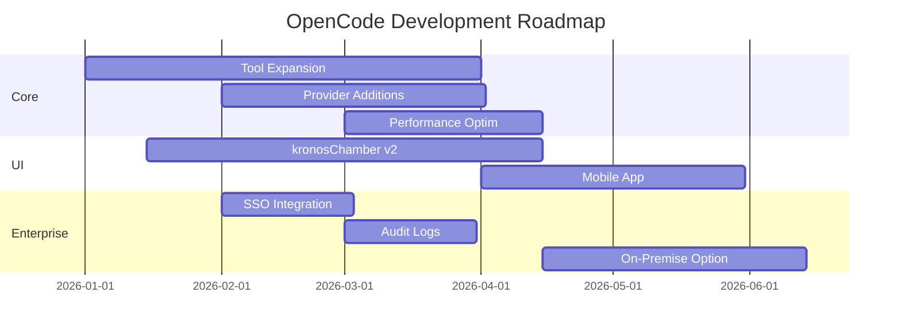

<p align="center">
  <a href="https://opencode.ai">
    <picture>
      <source srcset="packages/console/app/src/asset/logo-ornate-dark.svg" media="(prefers-color-scheme: dark)">
      <source srcset="packages/console/app/src/asset/logo-ornate-light.svg" media="(prefers-color-scheme: light)">
      
    </picture>
  </a>
</p>
<p align="center">The enterprise-grade AI coding assistant.</p>
<p align="center">
  <a href="https://opencode.ai/discord"></a>
  <a href="https://www.npmjs.com/package/@opencode-ai/sdk"></a>
  <a href="https://github.com/anomalyco/kronoscoder/actions/workflows/publish.yml"></a>
</p>

---

## OpenCode — The Production-Ready AI Coding Platform

OpenCode is an **enterprise-grade AI coding assistant** designed for professional development teams. Built with security, reliability, and performance in mind, OpenCode combines cutting-edge AI capabilities with deep system integration.

### Why OpenCode?

```
┌─────────────────────────────────────────────────────────────────┐
│                    OpenCode Architecture                         │
├─────────────────────────────────────────────────────────────────┤
│                                                                 │
│   ┌─────────────┐    ┌─────────────┐    ┌─────────────┐       │
│   │   Web UI    │    │  Desktop    │    │   VS Code   │       │
│   │  (React)    │    │  (Tauri)    │    │  Extension  │       │
│   └──────┬──────┘    └──────┬──────┘    └──────┬──────┘       │
│          │                   │                   │              │
│          └───────────────────┼───────────────────┘              │
│                              ▼                                  │
│                 ┌─────────────────────────┐                     │
│                 │   kronosChamber UI      │                     │
│                 │   (Unified Runtime)    │                     │
│                 └───────────┬─────────────┘                     │
│                             ▼                                   │
│   ┌─────────────────────────────────────────────────────────┐  │
│   │              OpenCode Core Engine                       │  │
│   │  ┌─────────┐ ┌─────────┐ ┌─────────┐ ┌─────────────┐  │  │
│   │  │ Tools   │ │Provider │ │ Session │ │  Native     │  │  │
│   │  │ (50+)   │ │  Layer   │ │ Manager │ │ Capabilities│  │  │
│   │  └─────────┘ └─────────┘ └─────────┘ └─────────────┘  │  │
│   └─────────────────────────────────────────────────────────┘  │
│                             ▼                                   │
│                 ┌─────────────────────────┐                     │
│                 │   AI Providers (20+)   │                     │
│                 │ Anthropic • OpenAI •   │                     │
│                 │ Google • xAI • Mistral │                     │
│                 └─────────────────────────┘                     │
│                                                                 │
└─────────────────────────────────────────────────────────────────┘
```

---

## Features

### 🧠 Intelligent Code Understanding



- **LSP Integration** — Go to definition, find references, hover information
- **Semantic Search** — Understand code context, not just keywords
- **Multi-File Analysis** — Analyze entire codebases

### 🔧 50+ Built-in Tools



### 🌍 Multi-Provider AI



**Supported Providers:**

- ✅ Anthropic — Claude 4 (Sonnet, Opus, Haiku)
- ✅ OpenAI — GPT-4o, o1, o3, o4
- ✅ Google — Gemini 2.0, 2.5 Pro/Flash
- ✅ xAI — Grok 2, Grok 3
- ✅ Mistral — Mistral Large, Codestral
- ✅ Cohere — Command R7B
- ✅ Cerebras — Fastest inference
- ✅ OpenRouter — 100+ models
- ✅ Azure OpenAI — Enterprise
- ✅ Amazon Bedrock — Claude, Llama
- ✅ GitHub Copilot — Claude 4 integration
- ✅ Perplexity — Online research
- ✅ Plus 10+ more providers

---

## kronosChamber — The Flagship Product

**kronosChamber** is the official OpenCode desktop application — a polished, production-ready IDE alternative that brings the full power of AI-assisted coding to your desktop.



### Why kronosChamber?

| Feature               | Description                                 |
| --------------------- | ------------------------------------------- |
| 🎨 **Beautiful UI**   | Modern React 19 interface with Tailwind v4  |
| 🖥️ **Cross-Platform** | Works on Web, Desktop (Tauri), VS Code      |
| 🔒 **Secure**         | Local processing, enterprise-grade security |
| ⚡ **Fast**           | Built on Bun runtime                        |
| 🔌 **Extensible**     | MCP support, custom skills, plugins         |

### Screenshots


---

## Native Capabilities



### 🔍 Screenpipe — AI Memory

- **Visual Context** — OCR screen capture for recall
- **Audio Memory** — Transcribe and recall meetings
- **UI History** — Track application usage
- **Input Logging** — Remember your actions

### 🌐 AI Browser — Web Automation

Agent-controlled web interactions:

- Page navigation & management
- Element interaction (click, fill, hover)
- Screenshot & snapshot capture
- Network monitoring
- Console access

### 🖥️ Everywhere — Cross-App Control

Control other applications via:

- **macOS** — AppleScript
- **Windows** — PowerShell
- **Linux** — Various backends

### 🛡️ OpenFang — Security Engine

- Dependency auditing
- Vulnerability scanning
- Automated patching
- Security best practices

---

## Installation

### kronosChamber (Recommended)

Download the desktop app for the best experience:

| Platform              | Download                              |
| --------------------- | ------------------------------------- |
| macOS (Apple Silicon) | `opencode-desktop-darwin-aarch64.dmg` |
| macOS (Intel)         | `opencode-desktop-darwin-x64.dmg`     |
| Windows               | `opencode-desktop-windows-x64.exe`    |
| Linux                 | `.deb`, `.rpm`, or AppImage           |

```bash
# macOS
brew install --cask kronosChamber

# Or download from:
# https://github.com/anomalyco/kronoscoder/releases
```

### CLI Installation

```bash
# Install universally
curl -fsSL https://opencode.ai/install | bash

# Or via package manager
bun add -g opencode
```

---

## Architecture Deep Dive



### Core Components

| Component           | Purpose                                      |
| ------------------- | -------------------------------------------- |
| **kronosChamber**   | Unified UI runtime (Web, Desktop, VS Code)   |
| **Core Engine**     | AI logic, tool execution, session management |
| **Provider Layer**  | Multi-provider support with fallback         |
| **Tool Registry**   | 50+ built-in tools + MCP + custom            |
| **Session Manager** | Context preservation, state management       |

---

## Configuration

### Environment Variables

```bash
# API Keys
OPENCODE_API_KEY          # OpenCode Zen (recommended)
ANTHROPIC_API_KEY         # Anthropic
OPENAI_API_KEY            # OpenAI
GOOGLE_API_KEY            # Google

# Features
KRONOSCODE_ENABLE_AI_BROWSER=1    # Enable AI Browser
KRONOSCODE_ENABLE_EXA=1           # Enable web/code search
```

### MCP Servers

Configure MCP servers for extended capabilities:

```json
{
  "mcp": {
    "github": {
      "type": "remote",
      "url": "https://api.github.com/mcp",
      "oauth": {
        "clientId": "your-client-id"
      }
    }
  }
}
```

---

## Enterprise Features



- 🔒 **Local Processing** — Your code never leaves your machine
- ⚙️ **Custom Skills** — Extend with your own tools
- 🔌 **MCP Support** — Model Context Protocol integration
- 📊 **Telemetry** — Usage analytics (optional)

---

## Comparison

| Feature                 | OpenCode  | Claude Code | Cursor | Windsurf |
| ----------------------- | --------- | ----------- | ------ | -------- |
| **Open Source**         | Core Only | ✅          | ❌     | ❌       |
| **Providers**           | 20+       | 1           | 3      | 3        |
| **Tools**               | 50+       | 15          | 30+    | 30+      |
| **Native Integrations** | ✅        | ❌          | ❌     | ❌       |
| **Screenpipe**          | ✅        | ❌          | ❌     | ❌       |
| **AI Browser**          | ✅        | ❌          | ✅     | ✅       |
| **Cross-App Control**   | ✅        | ❌          | ❌     | ❌       |
| **Desktop App**         | ✅        | ❌          | ✅     | ✅       |
| **VS Code**             | ✅        | ❌          | ✅     | ✅       |

---

## Roadmap



---

## Documentation & Support

- 📖 **Docs** — [opencode.ai/docs](https://opencode.ai/docs)
- 💬 **Discord** — [discord.gg/opencode](https://discord.gg/opencode)
- 🐦 **Twitter** — [x.com/opencodeai](https://x.com/opencodeai)
- 🐛 **Issues** — [github.com/anomalyco/kronoscoder/issues](https://github.com/anomalyco/kronoscoder/issues)

---

## License

**OpenCode Core** is open source (MIT License).

**kronosChamber** and the **OpenCode Zen** service are proprietary. Contact sales@opencode.ai for enterprise licensing.

---

<p align="center">
  <strong>Built with ❤️ by the OpenCode Team</strong>
</p>
