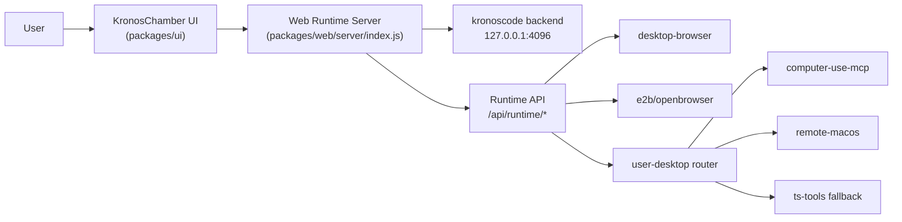
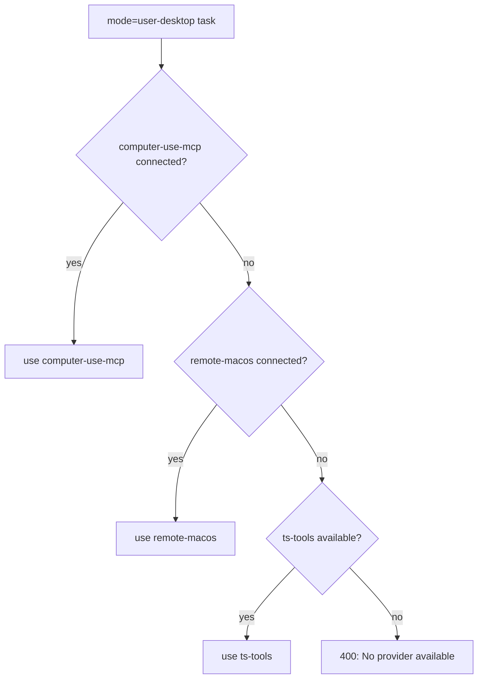
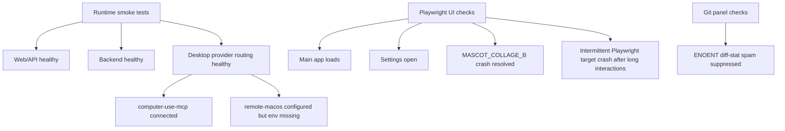
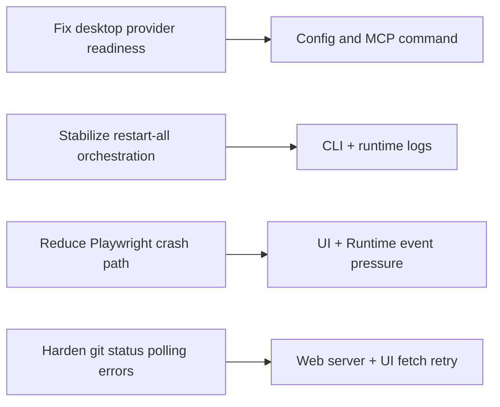
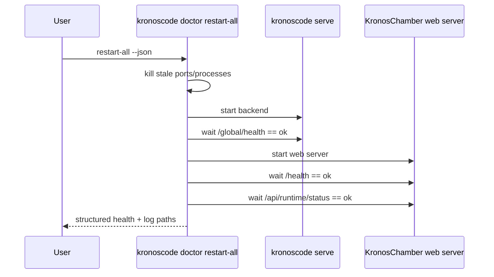
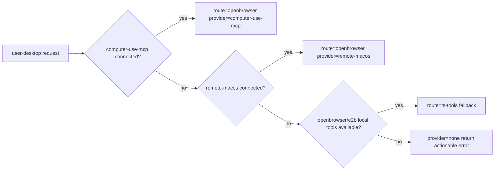

# KronosCode / KronosChamber Runtime Recovery Map

## 1) Runtime Topology

## 2) User Desktop Routing (Current)

## 3) Current Failure Tree (Validated)

## 4) Action Ownership

## 5) Restart Sequence Contract

## 6) Provider Readiness Matrix

